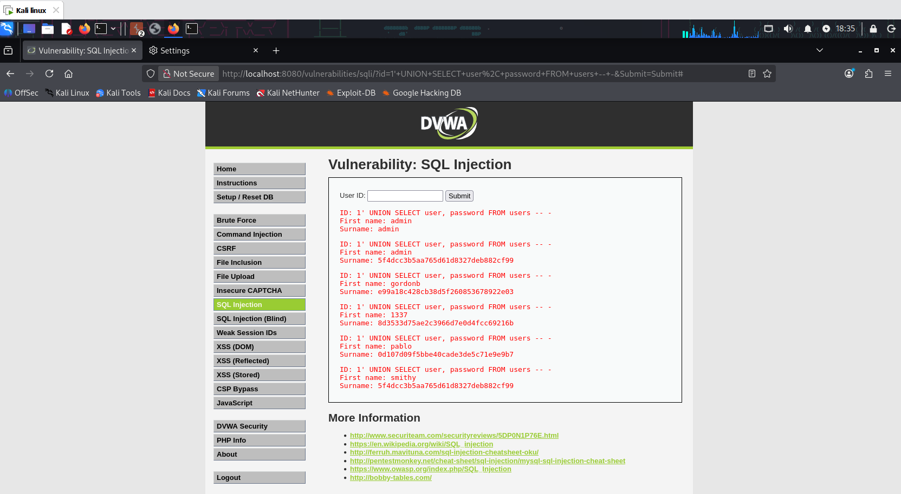
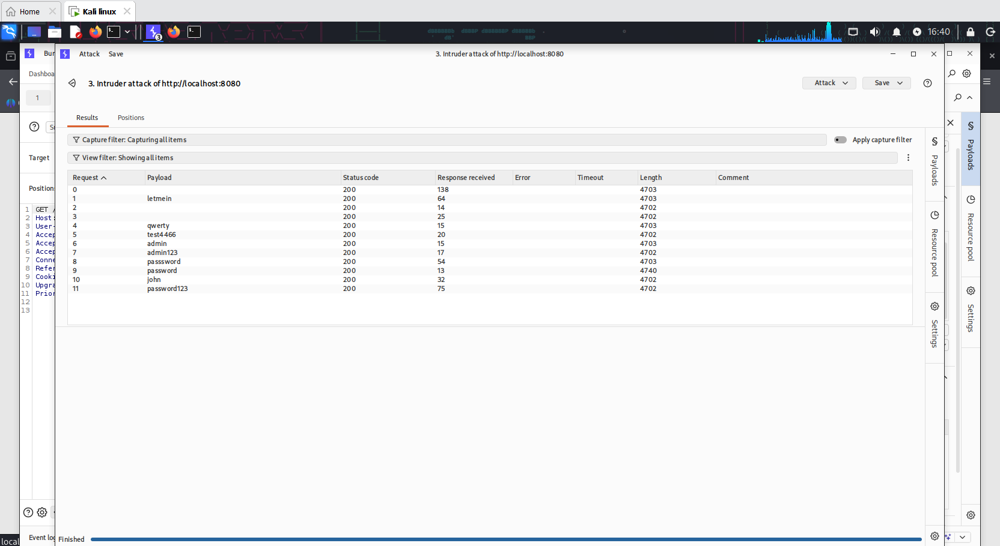
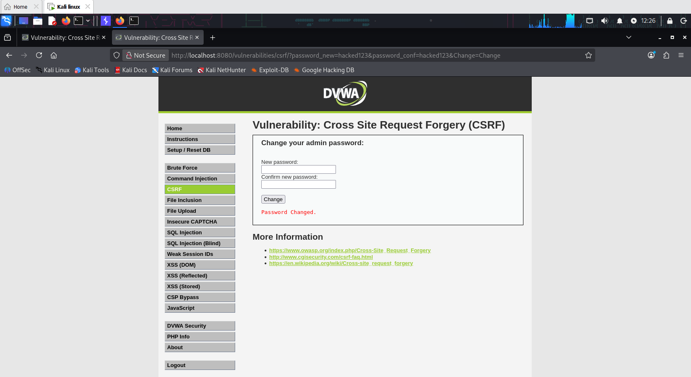
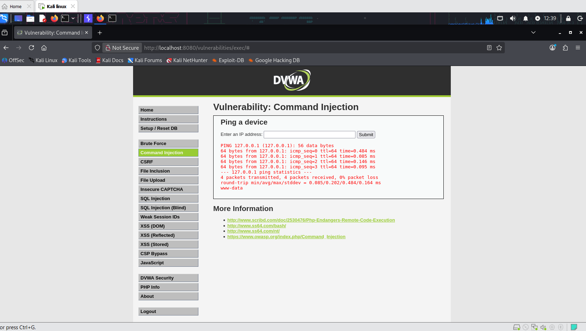
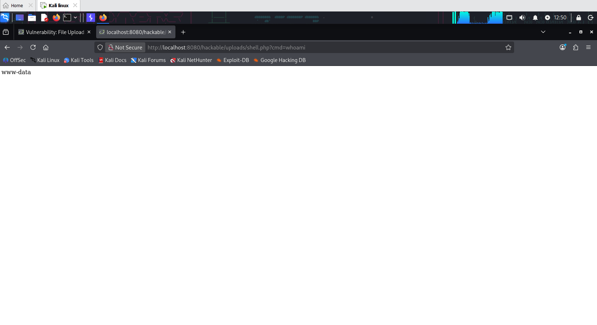
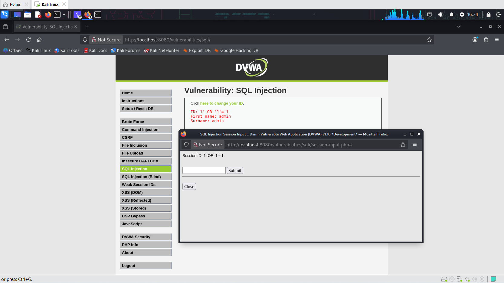

# dvwa-webapp-vapt
Black-box penetration test of DVWA covering 10 OWASP Top 10 vulnerabilities — SQL Injection, XSS, CSRF, Command Injection, File Upload/Inclusion &amp; more — with full exploitation chains, CVSS scoring, and a professional VAPT report.

# DVWA Web Application Penetration Testing

A complete black-box VAPT (Vulnerability Assessment & Penetration Testing) engagement against **Damn Vulnerable Web Application (DVWA)**, covering 10 OWASP Top 10 vulnerability classes — from discovery through exploitation, credential compromise, and remote code execution.

---

## 🎯 Objective

To identify, exploit, and document common web application vulnerabilities in a controlled lab environment, demonstrating both offensive testing methodology and the ability to communicate findings in a professional report format.

## 🧪 Scope

- **Target:** DVWA (Damn Vulnerable Web Application), deployed via Docker
- **Testing type:** Black-box, manual penetration testing
- **Security levels tested:** Low (primary exploitation), High (hardening comparison)
- **Environment:** Kali Linux (attacker) + Docker container (target), isolated local network

## 🛠️ Tools Used

| Tool | Purpose |
|---|---|
| Burp Suite (Proxy, Intruder, Repeater) | Request interception, automated brute-force, manual payload testing |
| Gobuster | Directory & file enumeration |
| John the Ripper | Offline password hash cracking |
| Firefox (Kali) | Manual testing & payload delivery |

## 📋 Methodology

1. **Reconnaissance** — Site mapping via Burp Suite, directory brute-forcing via Gobuster
2. **Vulnerability identification & exploitation** — mapped to OWASP Top 10, tested module by module
3. **Attack chaining** — combined findings to demonstrate realistic attacker workflows (e.g. SQLi → hash extraction → password cracking → independently reconfirmed via brute force)
4. **Hardening comparison** — re-tested key vulnerabilities at DVWA's High security level to evaluate mitigation effectiveness
5. **Reporting** — findings documented with CVSS scoring, screenshots, impact analysis, and remediation guidance

## 🔍 Key Findings Summary

| Vulnerability | Severity | CVSS (approx.) | Status |
|---|---|---|---|
| SQL Injection | Critical | 9.8 | Confirmed & Exploited |
| Brute Force (No Rate Limiting) | High | 8.1 | Confirmed & Exploited |
| XSS — Reflected | High | 6.1 | Confirmed |
| XSS — Stored | High | 8.8 | Confirmed |
| XSS — DOM-based | High | 6.1 | Confirmed |
| CSRF | High | 8.0 | Confirmed & Exploited |
| Command Injection | Critical | 9.8 | Confirmed & Exploited |
| Unrestricted File Upload | Critical | 9.8 | Confirmed & Exploited (RCE) |
| Local File Inclusion (LFI) | High | 7.5 | Confirmed |
| Security Misconfiguration | Medium | 5.3 | Confirmed |

**Overall risk posture: Critical** — multiple independent paths to full user-data compromise and remote code execution were identified.

### Notable attack chains

- **SQL Injection → Credential Compromise:** Extracted username/password hashes via UNION-based injection, cracked the admin hash with John the Ripper (`password`), and independently reconfirmed the same credential via a separate Burp Intruder brute-force attack.
- **File Upload → Remote Code Execution:** Uploaded a PHP web shell and executed arbitrary OS commands directly on the server.
- **LFI + File Upload (chainable):** The uploaded web shell could also be triggered through the File Inclusion vulnerability, showing how two separate findings compound into a single, more severe attack path.

## 📁 Repository Structure

```
dvwa-webapp-vapt/
├── README.md
├── report/
│   └── DVWA-VAPT-Report.docx      # Full report: methodology, findings, CVSS, remediation
├── screenshots/
│   ├── 00_setup/
│   ├── 01_recon/
│   ├── 02_sql_injection/
│   ├── 03_brute_force/
│   ├── 04_xss_reflected/
│   ├── 05_xss_stored/
│   ├── 06_xss_dom/
│   ├── 07_csrf/
│   ├── 08_command_injection/
│   ├── 09_file_upload/
│   ├── 10_file_inclusion/
│   └── 11_security_misconfig/
└── payloads/
    └── payloads_used.txt          # Every payload/command used, organized by module
```

## 🖼️ Screenshots

A few highlights from the engagement — full evidence set is in [`screenshots/`](./screenshots).

**SQL Injection — credentials extracted via UNION-based injection**


**Brute Force — Burp Intruder identifying the valid password by response length**


**CSRF — password changed via forged request, then used to log in**


**Command Injection — arbitrary OS command execution (whoami)**


**File Upload — web shell achieving remote code execution**


**Security Misconfiguration — SQLi still works at High level, XSS gets blocked**


> All screenshots referenced above assume the exact folder structure and filenames listed in [Repository Structure](#-repository-structure). Rename carefully if you change file names.

## 📄 Full Report

The complete penetration testing report — including executive summary, detailed methodology, per-vulnerability proof-of-concept steps, CVSS scoring, and prioritized remediation guidance — is available at [`report/DVWA-VAPT-Report.docx`](./report/DVWA-VAPT-Report.docx).

## 🧰 Skills Demonstrated

- OWASP Top 10 vulnerability identification & exploitation
- Burp Suite (Proxy, Repeater, Intruder) for manual and automated testing
- Password hash cracking (John the Ripper)
- Directory/file enumeration (Gobuster)
- Attack chaining across multiple vulnerability classes
- Professional VAPT report writing with CVSS-based severity rating and remediation planning

## ⚠️ Disclaimer

This testing was performed exclusively against a locally-hosted, intentionally vulnerable training application (DVWA) in an isolated lab environment. No production systems or third-party assets were tested. This work is for educational and portfolio purposes only.

---

**Author:** Mukul Kumar
**GitHub:** [mukulkumar-labs](https://github.com/mukulkumar-labs)
**LinkedIn:** [mukul-kumar-cysec17](https://linkedin.com/in/mukul-kumar-cysec17)
